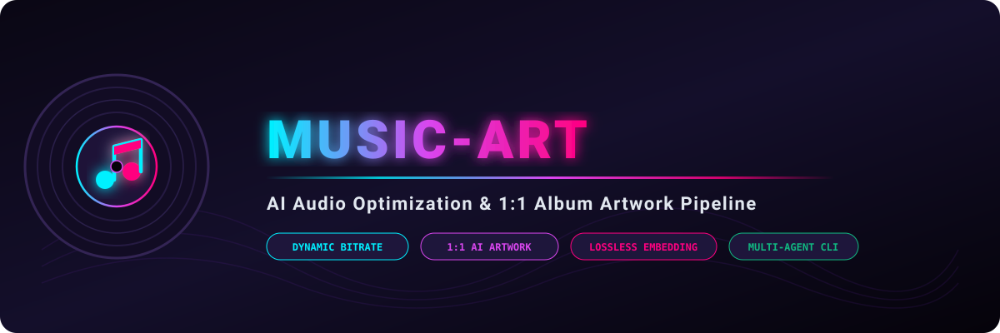

<div align="center">



# 🎵 music-art
### Universal AI Audio Optimization & 1:1 Album Artwork Pipeline

[](https://skills.sh/)
[](LICENSE)
[]()
[]()

</div>

---

**`music-art`** is a production-ready AI agent skill and CLI automation framework that solves two major challenges in digital music libraries:
1. **Intelligent Dynamic Compression**: Compresses long-form music tracks, podcasts, ambient frequency sessions, and DJ sets down to strict file-size limits (e.g. **<= 100 MB**) while computing the **highest mathematically possible bitrate** to preserve master-grade audio quality.
2. **AI-Driven 1:1 Album Artwork**: Generates gorgeous, square (1:1) album cover art customized to track genres and titles, asks the user where to store cover files during each session, and **losslessly embeds** the artwork into audio containers without audio re-encoding (`-c:a copy`).

---

## ⚡ Quick Start & Installation

Install globally for all your AI coding agents (**Antigravity**, **Claude Code**, **Cursor**, **Grok**, etc.) via the [Skills CLI](https://skills.sh):

```bash
# Global installation (recommended)
npx skills add xyz-rainbow/music-art -g

# Local project installation
npx skills add xyz-rainbow/music-art
```

Or clone directly into your agent skills path:
```bash
git clone https://github.com/xyz-rainbow/music-art.git ~/.agents/skills/music-art
```

---

## 🌟 Key Features

- 🧮 **Mathematical Bitrate Maximization**: Computes `TargetBitrate = floor((SafeBudgetBytes * 8) / Duration / 1000)` and snaps to optimal discrete AAC bitrates (64k–256k).
- 🌈 **Chromatic & Character Playlist Variation**: Anti-monotony engine dynamically assigns matching lore palettes (Purple, Cyan, Lime Green, Molten Orange, Blood Crimson, Pastels) and diverse avatars across large playlists.
- 🖼️ **1:1 Square Album Artwork**: Eliminates awkward 16:9 YouTube video thumbnails and replaces them with tailored 1:1 square covers with typography.
- 💬 **Interactive Session Storage Prompter**: Always clarifies or checks where artwork files should be stored (`/cover` folder, central drive, or direct embedding).
- 💎 **Lossless Artwork Muxing**: Fast, zero-recompression metadata injection using FFmpeg's `-c:a copy -c:v copy -disposition:v:0 attached_pic`.
- 🤖 **Universal Agent Interoperability**: Built with universal protocols ready for Antigravity, Grok, ChatGPT, Gemini, MiniMax, and Claude.

---

## 💻 CLI Usage & Scripts

### 1. Optimize Audio Files to <= 100 MB
```bash
# Optimize a single track in-place:
python scripts/optimize_audio.py "path/to/track.m4a" --max-size-mb 100

# Optimize an entire folder with custom safety margin:
python scripts/optimize_audio.py "U:/Music/ADHD" --max-size-mb 100 --safe-margin-mb 93
```

### 2. Extract Existing Covers to Inspect Dimensions
```bash
python scripts/extract_cover.py "path/to/track.m4a" -o "path/to/cover.jpg"
```

### 3. Losslessly Embed 1:1 Cover Art
```bash
python scripts/embed_cover.py "path/to/track.m4a" "path/to/cover.jpg"
```

### 4. Query or Set Session Cover Directory
```bash
# Query current session storage:
python scripts/storage_prompter.py --get

# Register a custom directory for the active session:
python scripts/storage_prompter.py --set "U:/Music/ADHD/cover"
```

### 5. Generate Playlist Chromatic & Character Variation Plan
```bash
# Generate a diverse palette & avatar plan across track titles:
python scripts/playlist_variation.py "02 Extraction Action" "03 The Rebel Path" "04 The Streets Are Long-Ass Gutters" --json
```

---

## 🎨 Prompt Engineering Guide for AI Covers

The skill includes pre-tested aesthetic prompts across 5 major music genres in [`SKILL.md`](./SKILL.md):
- **Ambient / Solfeggio / Neurodivergent Frequencies** (Holographic pastel brains, calming clouds, synthwave grid)
- **Dark Synthwave / Darkwave** (Gothic anime vampire aesthetics, crosses, twilight red skies)
- **Dark Orchestral / Memento Mori** (Baroque skeleton cellist, dark academic chiaroscuro)
- **Breakcore / Atmospheric DnB** (High-energy glitch ink-splatter, glowing violet energy halos)
- **Zen / Meditation** (Japanese sakura blossom trees, cascading mountain waterfalls, golden sunset)

---

## 🤝 Multi-Agent Architecture

This skill was architected for cross-agent compatibility:

- **Antigravity (Google)**: Runs native bash commands, manages background jobs, and invokes `generate_image`.
- **Grok (xAI)**: Uses Python CLI scripts and prompt templates for automated subagent workflows.
- **ChatGPT & Claude Code**: Discovers and runs tools via standard `npx skills` protocols.
- **MiniMax Code & Gemini**: Executes local CLI automation with full tag and metadata retention.

---

## 📜 License

Released under the [MIT License](LICENSE).  
Created with ❤️ by **[xyz-rainbow](https://github.com/xyz-rainbow)**.
