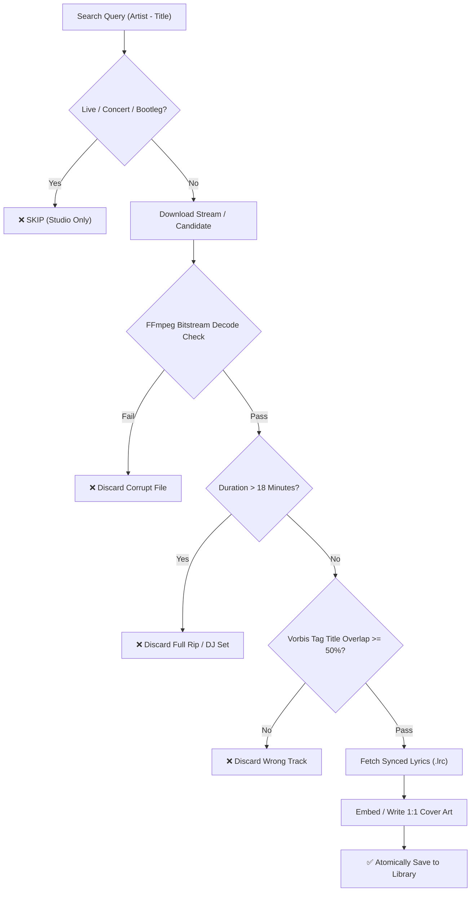

# 🎵 Music-XYZ-Skill — AI Audio Engineering, Parallel FLAC Downloader & Artwork Suite

`music-xyz-skill` (evolved from `music-art`) is a complete audio suite for AI agents (Antigravity, Grok, ChatGPT, Gemini, Claude, Cursor) and terminal operators.

It provides a full-lifecycle pipeline:
1. **Bit-Perfect FLAC Downloader**: Multi-source parallel downloading (Soulseek P2P, Archive.org streaming, Rutracker torrents).
2. **Strict Library Sanitization**: Zero tolerance for non-audio artifacts (`.sqlite`, `.xml`, `.cue`, `.log`). Strictly `.flac`, `.lrc`, and `.jpg`/`.png` cover files.
3. **Purity & Integrity Guards**:
   - **Full Bitstream Decode Check**: Verified with FFmpeg (`-f null -`) to guarantee 100% health.
   - **Tag Verification**: Vorbis comment title check ensures peers don't deliver wrong tracks.
   - **Duration Ceiling**: Strictly rejects continuous sets or full album rips exceeding **18 minutes**.
   - **No Live / Concert Rule**: Auto-rejects live sets, bootlegs, and concert recordings.
4. **Synced Lyrics Harvester**: Fetches UTF-8 `.lrc` files from LRCLIB for full player sync.
5. **Lossless Cover Art Embedding**: Embeds 1:1 square artwork directly into FLAC Vorbis comments (Picture type 3) without re-encoding audio.
6. **Smart Audio Compression (Legacy music-art)**: Dynamic mathematical bitrate maximization to keep lossy files strictly under **100 MB**.

---

## 🚀 Installation

```bash
# Global installation via Skills CLI
npx skills add xyz-rainbow/music-art -g

# Or direct clone into agent skills folder
git clone https://github.com/xyz-rainbow/music-art.git ~/.agents/skills/music-xyz-skill
```

---

## 🛠️ Modular Script Catalog

| Script | Purpose |
| :--- | :--- |
| [`scripts/flac_downloader.py`](file:///C:/Users/rainb/.agents/skills/music-art/scripts/flac_downloader.py) | Multi-threaded FLAC download engine with FFmpeg verification, tag checking, and lyrics. |
| [`scripts/flac_cleaner.py`](file:///C:/Users/rainb/.agents/skills/music-art/scripts/flac_cleaner.py) | Sanitizes directories: purges `.sqlite`/`.xml` artifacts, flags files > 18m, checks cover art. |
| [`scripts/embed_cover.py`](file:///C:/Users/rainb/.agents/skills/music-art/scripts/embed_cover.py) | Losslessly injects 1:1 covers into audio containers (`.flac`, `.m4a`, `.mp3`). |
| [`scripts/optimize_audio.py`](file:///C:/Users/rainb/.agents/skills/music-art/scripts/optimize_audio.py) | Dynamic mathematical bitrate compression to guarantee <= 100 MB limits. |
| [`scripts/extract_cover.py`](file:///C:/Users/rainb/.agents/skills/music-art/scripts/extract_cover.py) | Dumps embedded front cover art from audio files to standalone `.jpg`. |
| [`scripts/storage_prompter.py`](file:///C:/Users/rainb/.agents/skills/music-art/scripts/storage_prompter.py) | Prompts user interactively for cover art storage location. |

---

## 📋 Audio Library Rules & Protocols

When curating or downloading music into target libraries (e.g. `A:\...\[01]-[FLAC]` or portable DAPs `E:\...\[02]-[ FLAC ]`):



### Protocol Guidelines:
1. **Zero Garbage Files**: Only `.flac`, `.lrc`, and `cover.jpg`/`cover.png` are permitted in library folders. Never allow scraper metadata (`.sqlite`, `.xml`, `.nfo`) to remain.
2. **Embedded Art Priority**: Front covers should be written as embedded Vorbis picture blocks inside the `.flac` file. If not possible, a single `cover.jpg` in the album directory is maintained.
3. **18-Minute Ceiling**: Any track exceeding 18 minutes indicates an uncut album rip, live performance, or anomaly unless explicitly authorized by the user.
