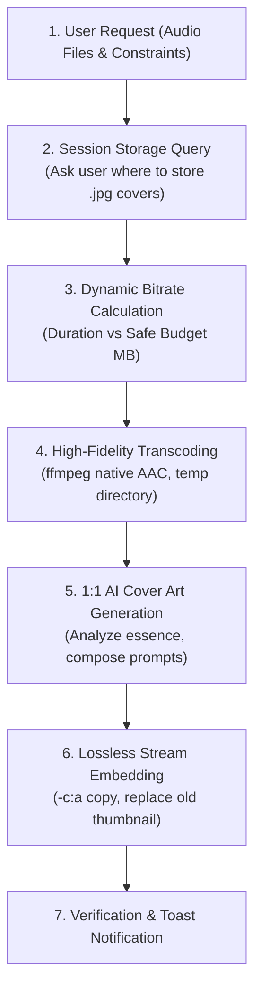

# 🎵 Music-Art — AI Audio Optimization & 1:1 Album Artwork Pipeline

`music-art` is a universal, multi-agent AI protocol and CLI engine designed to:
1. **Intelligently Compress Audio**: Guarantee tracks stay strictly under size limits (default: **<= 100 MB**) while computing the highest possible mathematical bitrate to retain near-master quality.
2. **Generate 1:1 AI Album Artwork**: Create square album covers matching the visual DNA of the tracks, incorporating elegant typography and stylistic themes.
3. **Session Cover Storage Protocol**: Interactively ask the user where generated artwork should be stored each session to keep libraries clean.
4. **Lossless Cover Embedding**: Embed newly minted 1:1 cover art directly into audio files (`.m4a`, `.mp3`) with **0% audio recompression** (`-c:a copy`).

---

## 🚀 Installation via Skills CLI

```bash
# Global installation (recommended for AI coding agents: Antigravity, Claude Code, Cursor, etc.)
npx skills add xyz-rainbow/music-art -g

# Project-level installation
npx skills add xyz-rainbow/music-art
```

Or clone directly into your agent skills directory:
```bash
git clone https://github.com/xyz-rainbow/music-art.git ~/.agents/skills/music-art
```

---

## 🤖 Universal Agent Protocol & Workflow

AI agents (Antigravity, Grok, ChatGPT, Gemini, MiniMax, Claude, Cursor) must follow this 4-step sequence when optimizing music tracks:



---

## 1. 🗂️ Step 1: Session Storage Protocol

> [!IMPORTANT]
> **Never assume or pollute arbitrary folders.** In every new session, if the user has not specified where generated cover files should reside, the AI agent must proactively ask or confirm:

### Recommended Agent Dialog:
```text
"Where should the generated 1:1 album cover images (.jpg) be saved for this session?
 1. In a dedicated central folder (e.g., U:\Music\ADHD\cover or custom path)
 2. In a local '/cover' subfolder inside the active music directory
 3. Next to each audio file with matching basenames
 4. Embedded directly into audio files (discarding standalone images)"
```

To automate or read this programmatically:
```bash
python scripts/storage_prompter.py --get
# Or to configure:
python scripts/storage_prompter.py --set "U:/Music/ADHD/cover"
```

---

## 2. 🎚️ Step 2: Dynamic Audio Bitrate Calculation

When reducing file sizes (e.g. `<= 100 MB`), the agent must calculate the optimal bitrate based on the exact track duration:

### Mathematical Formula:
$$\text{TargetBits} = \text{SafeBudgetMB} \times 1024 \times 1024 \times 8$$
$$\text{CalculatedKbps} = \left\lfloor \frac{\text{TargetBits}}{\text{DurationInSeconds} \times 1000} \right\rfloor$$

- **Safety Margin**: Use **92 MB – 94 MB** as the calculation target (`SafeBudgetMB`) for a 100 MB limit to account for container muxing and embedded cover art overhead.
- **Bitrate Thresholds**:
  - **$\ge 256\text{ kbps}$**: Capped at 256k AAC (perceptually indistinguishable from lossless).
  - **$192\text{ kbps}$ – $224\text{ kbps}$**: High-resolution studio streaming (tracks under 60 minutes).
  - **$140\text{ kbps}$ – $160\text{ kbps}$**: High-fidelity stereo broadcast (tracks between 60 – 90 minutes).
  - **$112\text{ kbps}$ – $128\text{ kbps}$**: Clean stereo fidelity (tracks between 90 – 120 minutes).
  - **$64\text{ kbps}$ – $72\text{ kbps}$**: Efficient long-form stereo (marathon tracks 2 – 4 hours).

### Python CLI Execution:
```bash
# Optimize a single file
python scripts/optimize_audio.py "U:/Music/ADHD/song.m4a" --max-size-mb 100

# Optimize an entire directory
python scripts/optimize_audio.py "U:/Music/ADHD" --max-size-mb 100 --safe-margin-mb 93
```

---

## 3. 🎨 Step 3: AI Cover Art Generation (1:1 Square)

Always generate album covers in a **1:1 square aspect ratio**. Analyze the original track title, artist, audio mood, and any existing thumbnail before generating.

### Genre Prompt Templates:

#### A. Ambient / Frequencies / Solfeggio / Neurodivergent
```text
A high-end 1:1 square music album cover art. An intricate, glowing holographic pastel glass brain floating peacefully upon soft white clouds against a calming pastel gradient sky (lavender, soft pink, pale turquoise). Beneath the clouds lies a clean retro synthwave wireframe grid stretching toward the horizon. Elegant modern typography at the top reading '[TRACK_TITLE]'. Serene, dreamy, soothing neurodivergent healing aesthetic.
```

#### B. Dark Synthwave / Darkwave / Gothic
```text
A high-end 1:1 square music album cover art. An edgy goth vampire girl with long flowing silver-white hair, smirking expression revealing sharp fangs, and glowing crimson-red eyes. She wears a black choker with a silver gothic cross pendant and dark victorian lace. In the background, gothic graveyard stone crosses under a deep red-tinted twilight sky with bats. Bold modern typography reading '[TRACK_TITLE]'. High quality, darkwave aesthetic.
```

#### C. Dark Orchestral / Classical / Memento Mori / Baroque
```text
A high-end 1:1 square music album cover art in dark academic baroque oil painting style. An aristocratic skeleton wearing an opulent crimson velvet frock coat with an ornate white ruffled lace jabot, passionately playing a classical cello in a candlelit gothic chamber with stained glass windows. Rich chiaroscuro lighting and deep shadows. Refined classical serif typography in muted gold reading '[TRACK_TITLE]'.
```

#### D. Atmospheric DnB / Breakcore / Glitch Manga
```text
A high-end 1:1 square music album cover art. Dynamic high-contrast manga ink drawing of an angelic figure in a shredded white dress with outstretched arms floating in a void of intense pitch-black and radiant electric neon-purple energy splatters and tangled threads. Glowing violet eyes and vibrant halo. Raw glitch ink-splatter aesthetic with modern cyberpunk typography reading '[TRACK_TITLE]' and subtitle 'DnB / Breakcore'.
```

#### E. Asian Zen / Meditation / Nature
```text
A high-end 1:1 square music album cover art. A tranquil Asian zen landscape at golden sunset. Lush pink cherry blossom trees with delicate petals drifting softly in the warm evening air, a serene cascading waterfall into a calm crystal stream, and a traditional pagoda on misty purple mountain slopes. Clean, elegant modern typography reading '[TRACK_TITLE]'. Meditative, peaceful ambient album artwork.
```

---

## 4. 💽 Step 4: Lossless Artwork Embedding

Once the 1:1 image is saved, embed it into the `.m4a` file without recompressing the audio:

```bash
# Python CLI:
python scripts/embed_cover.py "U:/Music/ADHD/track.m4a" "U:/Music/ADHD/cover/artwork.jpg"
```

Or using native FFmpeg:
```bash
ffmpeg -y -i "input.m4a" -i "cover.jpg" \
  -map 0:a -map 1:v \
  -c:a copy -c:v copy \
  -disposition:v:0 attached_pic \
  -map_metadata 0 \
  "temp_output.m4a"
```

---

## 🛠️ Multi-Agent Compatibility Matrix

| AI Agent | Integration Method | Capabilities |
| :--- | :--- | :--- |
| **Antigravity (Google)** | Built-in native tools (`run_command`, `generate_image`) | Full end-to-end pipeline execution |
| **Grok (xAI)** | Terminal / CLI execution via subagents | Fast Python CLI execution & art prompting |
| **ChatGPT (OpenAI Code)** | Python environment / Advanced Data Analysis | Audio transcoding and DALL-E 3 cover generation |
| **Gemini CLI (Google)** | Function calling & shell tools | Automated dynamic bitrate calculation |
| **MiniMax Code** | Shell & local filesystem commands | Batch folder processing & tag preservation |
| **Claude Code (Anthropic)** | Bash tool execution via `npx skills` | Complete multi-file transcoding & verification |

---

## 📄 License

MIT License. Crafted with ❤️ by [xyz-rainbow](https://github.com/xyz-rainbow).
